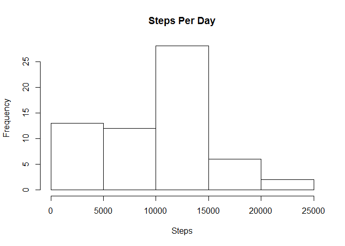
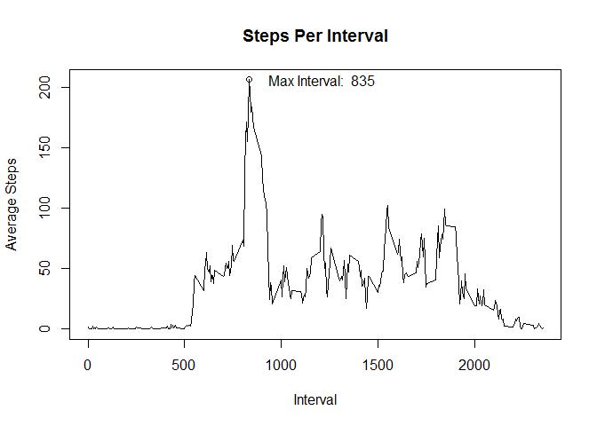

# Reproducible Research: Peer Assessment 1

## Loading and preprocessing the data

```r
library(dplyr)
library(lattice)
activity <- tbl_df(read.csv(unz("activity.zip","activity.csv")))
daily_activity <- group_by(activity,date)
interval_activity <- group_by(activity,interval)
interval_mean <- summarise(interval_activity, mean(steps, na.rm=TRUE))
names(interval_mean) = c("interval","mean_steps")
```


## What is mean total number of steps taken per day?

```r
steps_day <- summarise(daily_activity, sum(steps, na.rm=TRUE) )
names(steps_day) <- c("date","steps")
hist(steps_day$steps, main="Steps Per Day", xlab="Steps")
```

 

The mean number of steps per day was:

```r
mean(steps_day$steps)
```

```
## [1] 9354.23
```

The mediam number of steps per day was:

```r
median(steps_day$steps)
```

```
## [1] 10395
```


## What is the average daily activity pattern?

```r
steps_interval <- summarise(interval_activity, mean(steps, na.rm=TRUE))
names(steps_interval) <- c("interval","steps")
max_steps_interval = filter(steps_interval, steps == max(steps_interval$steps))
plot(steps_interval$interval,steps_interval$steps, type="l", xlab="Interval", 
     ylab="Average Steps", main="Steps Per Interval")
points(max_steps_interval)
text(max_steps_interval$interval + 375, max_steps_interval$steps,paste("Max Interval: ", max_steps_interval$interval))
```

 

As seen on the line chart the 5 minute interval with the maximum average number of steps per day was:

```r
max_steps_interval
```

```
## Source: local data frame [1 x 2]
## 
##   interval    steps
## 1      835 206.1698
```

## Imputing missing values

```r
sum(is.na(activity$steps))
```

```
## [1] 2304
```

```r
imputed_activity <- merge(activity, interval_mean, by.x="interval", by.y="interval")
imputed_activity <- mutate(imputed_activity, steps2 = ifelse(is.na(steps), mean_steps, steps))

imputed_activity <- select(imputed_activity,-steps, -mean_steps )
names(imputed_activity) <- c("interval","date","steps")

daily_activity_imp <- group_by(imputed_activity,date)
steps_day_imp <- summarise(daily_activity_imp, sum(steps, na.rm=TRUE) )
names(steps_day_imp) <- c("date","steps")
hist(steps_day_imp$steps, main="Steps Per Day", xlab="Steps")
```

 

```r
mean(steps_day_imp$steps)
```

```
## [1] 10766.19
```

```r
median(steps_day_imp$steps)
```

```
## [1] 10766.19
```

When looking at the data with na values in the dataset for steps replaced with the mean value for that specific time interval the values are affecte at the lower end of the steps per day.  The histogram of the data shows that the interval for 5000 steps per day is much  different than it was without this data replacement.

In addition if you compare the mean and median values you can see that values aren't too much different.

Data Type     |Mean Steps Per Day| Median Steps Per Day
--------------|------------------|-----------------------
With NA       |9354.23           |  10395
Impute Values |10766.19          |  10766.19

## Are there differences in activity patterns between weekdays and weekends?

```r
imp_activity_days <- mutate(imputed_activity, dow = 
                              ifelse(weekdays(as.Date(activity$date,"%Y-%m-%d")) %in%
                                       c("Saturday","Sunday"), "weekend","weekday"))

imp_activity_days$dow = as.factor(imp_activity_days$dow)
dow_interval_imp <- group_by(imp_activity_days,dow,interval)
steps_dow_imp <- summarise(dow_interval_imp, mean(steps))
names(steps_dow_imp) <- c("dow","interval","steps")
xyplot(steps ~ interval | dow, data=steps_dow_imp, layout=c(1,2), type="l")
```

 
